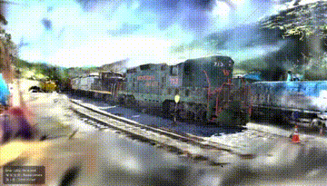

# Gaussian Splatting viewer

<p>
  
</p>

A 3D Gaussian Splatting viewer implemented with Rust and wgpu.

It loads trained 3DGS PLY files and renders them using a GPU-based tile rendering pipeline.

## Main features

- Load 3DGS `.ply` files
- Render Gaussian splats with wgpu
- Tile-based Rendering
- WebGPU support
- Native desktop support

## Rendering pipeline

This viewer renders 3D Gaussian Splatting scenes using a GPU-based tile rendering pipeline.

- **Preprocess pass**: projects each Gaussian to screen space, evaluates SH degree 3 color, computes the 2D covariance/conic, opacity, depth, radius, and touched tile bounds.
- **Prefix scan pass**: computes offsets from the number of tiles touched by each visible Gaussian.
- **Duplicate pass**: expands each visible Gaussian into per-tile entries with tile ID and depth.
- **Radix sort pass**: sorts duplicated entries by tile ID and depth.
- **Tile range pass**: finds the range of sorted entries belonging to each tile.
- **Render pass**: blends sorted Gaussians per tile.

## Controls

- Drag and drop a .ply file to load a 3DGS scene
- W / A / S / D: rotate camera
- Q / E: zoom in / out

## Build Locally

### Native Desktop

```
cargo run --release
```

### Web

Build the WebAssembly package:

```
wasm-pack build --target web --release
```

Then serve the project directory with a local HTTP server.

For example:

```
python3 -m http.server 8080
```

Open the following URL in your browser:

```
http://localhost:8080
```

## Notes

- Tested on macOS with Apple M4 and 24 GB RAM.
- Web version tested on Chrome 148 and Safari 26.
- The radix sort implementation is based on [VkRadixSort](https://github.com/MircoWerner/VkRadixSort) and adapted for wgpu/WGSL.
- Performance and compatibility may vary depending on GPU, browser, and WebGPU implementation.


## Dataset Attribution

The demo GIF was generated using a trained PLY file from the Gaussian Splatting dataset by Paula Ramos.

Dataset: https://huggingface.co/datasets/Voxel51/gaussian_splatting  
License: Apache License 2.0

The dataset was created using the official 3D Gaussian Splatting method:

Kerbl et al., “3D Gaussian Splatting for Real-Time Radiance Field Rendering”, 2023.
