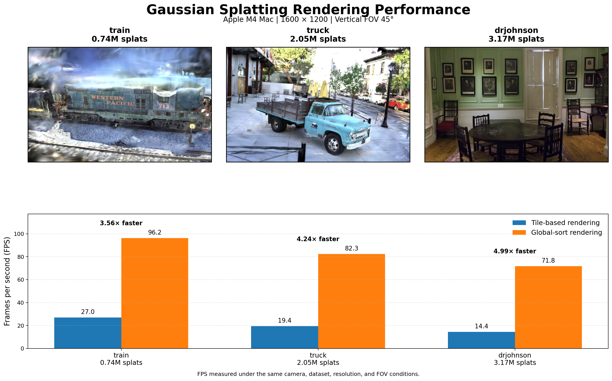

# Gaussian Splatting viewer

<table>
  <tr>
    <td>
      
    </td>
    <td>
      
    </td>
  </tr>
</table>

A Gaussian Splatting viewer implemented with Rust and wgpu.

It loads trained 3DGS PLY/SOG files and Space-Time Gaussian Lite PLY files.

The viewer provides two GPU rendering backends:

- **Global Sort mode**: the default renderer, which globally sorts visible Gaussians by 32-bit depth and renders them as instanced quads.
- **Tile mode**: classifies Gaussians into screen-space tiles and blends them per tile.


## Main features

- Load 3DGS `.ply` files
- Load 3DGS `.sog` files
- Load Space-Time Gaussian Lite `.ply` files
- Render Gaussian splats with wgpu
- Global GPU depth sorting
- Compact GPU preprocessing of visible Gaussians
- Indirect compute dispatch and indirect drawing
- Instanced Gaussian quad rendering
- Optional GPU-based tile rendering pipeline
- WebGPU support
- Native desktop support

## Rendering modes

### Global Sort mode

Global Sort mode is the default rendering backend.

It is based on the global depth-sorting and instanced quad rendering approach used by [antimatter15/splat](https://github.com/antimatter15/splat).

It preprocesses visible Gaussians into a compact GPU buffer, generates sortable 32-bit depth keys, globally sorts the visible Gaussians, and renders them as instanced quads using fixed-function blending.

The Global Sort pipeline consists of the following GPU passes:

* **Preprocess pass**: evaluates and projects visible Gaussians into screen space, writes them into a compact GPU buffer, and generates sortable 32-bit depth keys.
* **Build indirect arguments pass**: generates both compute dispatch arguments and draw indirect arguments from the visible Gaussian count.
* **Radix sort pass**: globally sorts visible Gaussians by depth.
* **Render pass**: renders the sorted Gaussians as instanced quads using fixed-function blending.

The preprocess step differs slightly depending on the scene format. Static 3DGS scenes evaluate standard Gaussian attributes and SH color, while Space-Time Gaussian Lite scenes first evaluate their time-dependent attributes at the current time.

After preprocessing, all supported formats use the same global sorting and rendering pipeline.

### Tile mode

Tile mode is an optional GPU-based tile rendering backend.

It divides the screen into fixed-size tiles and builds data that allows each tile to access the Gaussians affecting it in depth order.

As in Global Sort mode, the preprocess step differs slightly between static 3DGS scenes and Space-Time Gaussian Lite scenes. After preprocessing, the tile-based pipeline consists of the following GPU passes:

- **Prefix scan pass**: computes offsets from the number of tiles touched by each visible Gaussian.
- **Duplicate pass**: expands each visible Gaussian into per-tile entries with tile ID and depth.
- **Radix sort pass**: sorts duplicated entries by tile ID and depth.
- **Tile range pass**: finds the range of sorted entries belonging to each tile.
- **Tile render pass**: blends sorted Gaussians per tile.

Tile mode requires more preprocessing and intermediate GPU memory usage than Global Sort mode, but it provides explicit tile-level access to the Gaussians affecting each screen region.

### Performance

Global Sort mode was compared with Tile mode on an Apple M4 Mac at a resolution of 1600 × 1200 with a vertical field of view of 45 degrees.  
The same datasets, camera positions, and rendering conditions were used for both modes.  
Global Sort mode achieved approximately 3.6× to 5.0× the frame rate of Tile mode in the tested scenes.

<p>
  
</p>


## Controls

- Drag and drop a `.ply` or `.sog` file to load a Gaussian Splatting scene
- W / A / S / D: rotate camera
- Q / E: zoom in / out

## Build Locally

### Native Desktop

```sh
cargo run --release
```

### Enable Tile mode

Build and run with the `tile-renderer` Cargo feature:

```sh
cargo run --release --features tile-renderer
```

Without this feature, the viewer uses Global Sort mode.

### Web

Build the WebAssembly package:

```sh
wasm-pack build --target web --release
```

To build the Web version with Tile mode enabled:

```sh
wasm-pack build \
  --target web \
  --release \
  --features tile-renderer
```

Then serve the project directory with a local HTTP server.

For example:

```sh
python3 -m http.server 8080
```

Open the following URL in your browser:

```text
http://localhost:8080
```

## Version history

### v-0.4.0

Added Global Sort mode and made it the default rendering backend.

- Added 32-bit global depth sorting for visible Gaussians
- Added indirect dispatch and instanced quad rendering
- Added Global Sort support for 3DGS and Space-Time Gaussian Lite scenes
- Retained Tile mode as an optional backend

### v-0.3.0

Added 3DGS SOG support.

- Added `.sog` file loading
- Added SOG v2 metadata parsing
- Added WebP-based decoding for positions, rotations, scales, opacity, SH0, and higher-order SH coefficients
- Integrated decoded SOG scenes into the existing GPU-based tile rendering pipeline

### v-0.2.0

Added Space-Time Gaussian Lite viewer support.

- Added Space-Time Gaussian Lite PLY loading
- Added time-dependent preprocess for `position(t)`, `rotation(t)`, and `opacity(t)`
- Added 4DGS playback support

### v-0.1.0

Initial 3D Gaussian Splatting viewer.

- Added 3DGS PLY loading
- Added GPU-based tile rendering pipeline
- Added WebGPU and native desktop support

## Notes

- Tested on macOS with Apple M4 and 24 GB RAM.
- Web version tested on Chrome 148 and Safari 26.
- Performance and compatibility may vary depending on GPU, browser, and WebGPU implementation.
- 4DGS support currently means STG-Lite support. Other 4DGS variants are not supported yet.
- SOG support currently targets SOG v2 files.

## Dataset Attribution

[The 3DGS demo GIF](docs/demo-train-3dgs.gif) was generated using a trained PLY file from the Gaussian Splatting dataset by Paula Ramos.

Dataset: https://huggingface.co/datasets/Voxel51/gaussian_splatting
License: Apache License 2.0

The dataset was created using the official 3D Gaussian Splatting method:

Kerbl et al., “3D Gaussian Splatting for Real-Time Radiance Field Rendering”, 2023.

[The STG-Lite demo GIF](docs/demo-flame-stg-lite.gif) was generated using a pretrained PLY model from the official SpacetimeGaussians project.

- Project page: https://oppo-us-research.github.io/SpacetimeGaussians-website/
- Official implementation: https://github.com/oppo-us-research/SpacetimeGaussians

Please refer to the original repositories and datasets for their licenses and additional use limitations.

## Acknowledgements

The Global Sort rendering mode was developed with reference to [splat](https://github.com/antimatter15/splat). It adapts the global depth-sorting and instanced Gaussian rendering approach to Rust, wgpu, and WGSL.

STG-Lite support is based on the representation introduced in **Spacetime Gaussian Feature Splatting for Real-Time Dynamic View Synthesis**.

The STG-Lite implementation was developed with reference to [splatv](https://github.com/antimatter15/splatv) and the official [SpacetimeGaussians](https://github.com/oppo-us-research/SpacetimeGaussians) implementation.

The radix sort implementation is based on [VkRadixSort](https://github.com/MircoWerner/VkRadixSort) and adapted for wgpu/WGSL.
